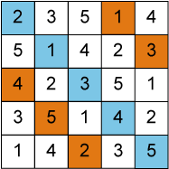

<table class="menu" border="0" cellspacing="0" cellpadding="20" width="900px">
<tr>
<td class="menu" bgcolor="#3B5998"><a href="http://tsoh.org/scarab/">Home</a></td>
<td class="menu" bgcolor="#3B5998"><a href="http://kix.istc.kobe-u.ac.jp/~soh/scarab/examples.html">Examples</a></td>
<td class="menu" bgcolor="#3B5998"><a href="http://kix.istc.kobe-u.ac.jp/~soh/scarab/doc.html">Documents</a></td>
<td class="menu" bgcolor="#3B5998"><a href="http://kix.istc.kobe-u.ac.jp/~soh/scarab/advanced.html">Advanced Usage</a></td>
<td class="menu" bgcolor="#3B5998"><a href="http://kix.istc.kobe-u.ac.jp/~soh/scarab/apps.html">Apps</a></td>
</tr>
</table>

# Overview

This page details **Scarab**, a prototyping tool for developing SAT-based CP systems. 
Features of Scarab are follows:

-   **Expressiveness** Rich constraint modeling language.
-   **Efficiency** Optimized order encoding and native handling of BC/PB on Sat4j.
-   **Customizability** Its core part is written in around 1000 lines of Scala.
-   **Portability** Run on JVM.

## How to use it

-   Download [the latest version](http://kix.istc.kobe-u.ac.jp/~soh/scarab/scarab-v1-6-9.zip).

-   Write your own Scarab program. For instance, let&rsquo;s write a program solving Pandiagonal Latin Square **PLS(n)**.  
    -   a problem of placing different \(n\) numbers into \(n \times n\) matrix
    -   such that each number is occurring exactly once
    -   for each row, column, diagonally down right, and diagonally up right.

 

    import jp.kobe_u.scarab._
    import dsl._
    
    var n: Int = 5
    for (i <- 1 to n; j <- 1 to n)  int('x(i,j),1,n) 
    for (i <- 1 to n) {
      add(alldiff((1 to n).map(j => 'x(i,j))))
      add(alldiff((1 to n).map(j => 'x(j,i))))
      add(alldiff((1 to n).map(j => 'x(j,(i+j-1)%n+1))))
      add(alldiff((1 to n).map(j => 'x(j,(i+(j-1)*(n-1))%n+1))))}
    
    if (find)  println(solution.intMap)

-   Sava this program as **pls.sc**.
-   To run **pls.sc**, just execute it as follows, that&rsquo;s all !

    scala -cp scarab-$VERSION.jar pls.sc

## More resources

-   you can find more examples [&ldquo;example&rdquo; page](http://kix.istc.kobe-u.ac.jp/~soh/scarab/examples.html).
-   you can also find more documents [&ldquo;documents&rdquo; page](http://kix.istc.kobe-u.ac.jp/~soh/scarab/doc.html).

## Note

-   This software is distributed under the [BSD License](http://opensource.org/licenses/bsd-license.php). See [LICENSE](./LICENSE) file.
-   scarab-<version>.jar includes [Sat4j](http://www.sat4j.org) package and [Sugar](http://bach.istc.kobe-u.ac.jp/sugar/) for the ease of use.
    -   We really appreciate the developers of Sat4j and Sugar!
    -   Sat4j used for inference engine.
    -   Sugar used for preprocessor (from 1.5.4).

# Release Note

-   [2015.11.01] Sat4j and Sat4j-PB (Rev2428) are included.

-   [2015.06.14] [ZIP of Scarab Package](./scarab-v1-6-9.zip) &#x2013; Version 1.6.9 is released.

    -   changes will be updated soon.

-   [2015.05.25] [JAR of Scarab](./scarab168.jar) &#x2013; Version 1.6.8 is released.

    -   changes will be updated soon.

-   [2015.02.08] [JAR of Scarab](./scarab-v1-5-7.jar) &#x2013; Version 1.5.7 is released.

    -   To run this version, Scala 2.11.\* or higher is required.
    -   Addition of new functions.
        -   UNSAT Core dectection in CSP level.
        -   Nested commit.
        -   Built-in optimization function.
    -   Refactoring for some parts.

-   [2015.01.09] [JAR of Scarab](./scarab-v1-5-6.jar) &#x2013; Version 1.5.6 is released.

    
    -   To run this version, Scala 2.11.\* or higher is required.
    -   Support non-contiguous domain.
    -   Performance improvement.
        -   Order Encoding Module is tuned.
        -   Native PB Constraint is tuned.

-   See history until 2014 [here](./history.html).

# Publications

-   Scarab: A Rapid Prototyping Tool for SAT-based Constraint Programming Systems (Tool Paper)
    -   Takehide Soh, Naoyuki Tamura, and Mutsunori Banbara
    -   In the Proceedings of the 16th International Conference on Theory and Applications of Satisfiability Testing (SAT 2013), LNCS 7962, pp. 429-436, 2013.
-   System Architecture and Implementation of a Prototyping Tool for SAT-based Constraint Programming Systems
    -   Takehide Soh, Naoyuki Tamura, Mutsunori Banbara, Daniel Le Berre, and Stéphanie Roussel
    -   In the Proceedings of Pragmatics of SAT 2013 (PoS-13), 14 pages, July 2013.

# Links for Related Tool

<table border="2" cellspacing="0" cellpadding="6" rules="groups" frame="hsides">

<colgroup>
<col  class="left" />

<col  class="left" />
</colgroup>
<tbody>
<tr>
<td class="left">[Sat4j](http://www.sat4j.org)</td>
<td class="left">SAT solver in Java, which Scarab adopts!</td>
</tr>

<tr>
<td class="left">[Sugar](http://bach.istc.kobe-u.ac.jp/sugar/)</td>
<td class="left">SAT-based CSP Solver using order encoding.</td>
</tr>

<tr>
<td class="left">[Copris](http://bach.istc.kobe-u.ac.jp/copris/)</td>
<td class="left">Copris is a constraint programming DSL embedded in Scala.</td>
</tr>

<tr>
<td class="left">&#xa0;</td>
<td class="left">It is also developed by our team!</td>
</tr>

<tr>
<td class="left">[Numberjack](http://numberjack.ucc.ie)</td>
<td class="left">Constraint Programming System in Python</td>
</tr>

<tr>
<td class="left">[SCP](http://lara.epfl.ch/web2010/scp)</td>
<td class="left">Constraint Programming in Scala using Z3</td>
</tr>

<tr>
<td class="left">[scalasmt](http://code.google.com/p/scalasmt/)</td>
<td class="left">SMT in Scala using Z3</td>
</tr>

<tr>
<td class="left">[OscaR](https://bitbucket.org/oscarlib/oscar)</td>
<td class="left">OR in Scala</td>
</tr>

<tr>
<td class="left">[JaCoP](http://jacop.osolpro.com/)</td>
<td class="left">Constraint programming in Java and Scala</td>
</tr>

<tr>
<td class="left">[Choco](http://www.emn.fr/x-info/choco-solver/)</td>
<td class="left">Constraint programming in Java</td>
</tr>

<tr>
<td class="left">[JSR 331](http://jcp.org/en/jsr/detail?id%3D331)</td>
<td class="left">Java Specification Requests: Constraint Programming API</td>
</tr>

<tr>
<td class="left">[BEE](http://amit.metodi.me/research/bee/)</td>
<td class="left">a compiler which enables to encode finite domain constraint problems to CNF.</td>
</tr>
</tbody>
</table>
